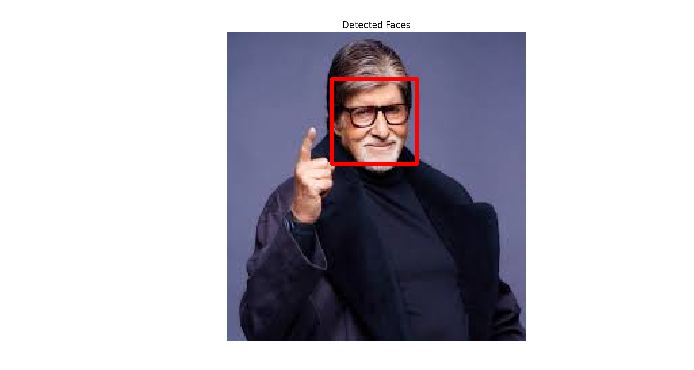

# Computer Vision Explorer

[](https://share.streamlit.io/yourusername/computer-vision-project/main/app.py)

A simple computer vision application that allows users to apply various image processing techniques and face detection to uploaded images.



## Features

- **Image Processing Techniques**
  - Grayscale conversion
  - Gaussian blur with adjustable kernel size
  - Edge detection with adjustable thresholds
- **Face Detection**
  - Detects faces in images using Haar Cascade classifier
  - Highlights detected faces with blue rectangles


## Getting Started

### Prerequisites

- Python 3.7+
- pip

### Installation

1. Clone the repository
   ```bash
   git clone https://github.com/yourusername/computer-vision-project.git
   cd computer-vision-project
   ```

2. Create and activate a virtual environment
   ```bash
   python -m venv venv
   ```
   
   On Windows:
   ```bash
   venv\Scripts\activate
   ```
   
   On macOS/Linux:
   ```bash
   source venv/bin/activate
   ```

3. Install dependencies
   ```bash
   pip install -r requirements.txt
   ```

### Usage

#### Running the Basic Image Processing Script

```bash
python image_processing.py
```

#### Running the Face Detection Script

```bash
python face_detection.py
```

#### Running the Streamlit App Locally

```bash
streamlit run app.py
```

## Project Structure

```
computer-vision-project/
├── app.py                  # Streamlit web application
├── image_processing.py     # Basic image processing script
├── face_detection.py       # Face detection script
├── requirements.txt        # Project dependencies
├── assets/                 # Screenshots and images
├── README.md               # This file
└── .gitignore              # Git ignore file
```

## Technologies Used

- [OpenCV](https://opencv.org/) - Open Source Computer Vision Library
- [NumPy](https://numpy.org/) - Numerical computing library
- [Matplotlib](https://matplotlib.org/) - Visualization library
- [Streamlit](https://streamlit.io/) - Web application framework

## Blog Post

For a detailed walkthrough of how this project was built, check out my blog post: [Make Your First Computer Vision Project: A Step-by-Step Guide](https://abmukherjee.hashnode.dev/make-your-first-computer-vision-project-a-step-by-step-guide)

## Future Enhancements

- Add more image processing techniques
- Implement object detection
- Create a real-time webcam version
- Add image classification capabilities

## License

This project is licensed under the MIT License - see the [LICENSE](LICENSE) file for details.

## Acknowledgments

- [OpenCV Documentation](https://docs.opencv.org/)
- [Streamlit Documentation](https://docs.streamlit.io/)
- [Python Pillow Library](https://python-pillow.org/)
